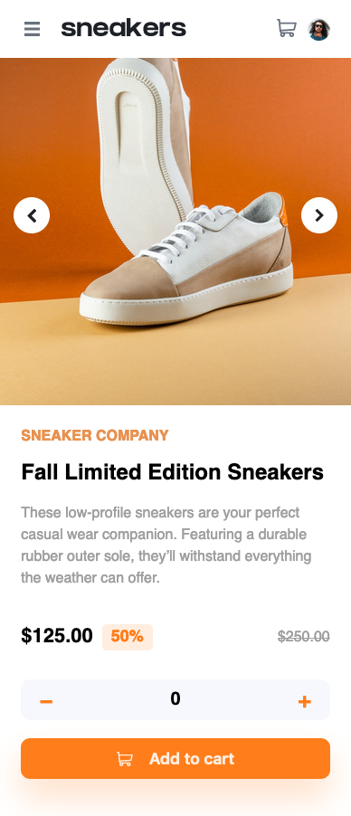
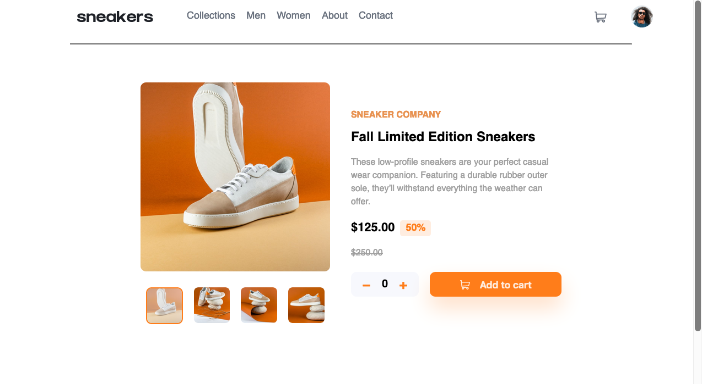

# Frontend Mentor - E-commerce product page solution

This is a solution to the [E-commerce product page challenge on Frontend Mentor](https://www.frontendmentor.io/challenges/ecommerce-product-page-UPsZ9MJp6).

### Links

- Live Site URL: [Site URL](https://e-commerce-product-page-xi.vercel.app/)

### Built with

- HTML
- CSS
- Javascript

- Any libraries has not been used

### The challenge

Users should be able to:

- View the optimal layout for the site depending on their device's screen size
- See hover states for all interactive elements on the page
- Open a lightbox gallery by clicking on the large product image
- Switch the large product image by clicking on the small thumbnail images
- Add items to the cart
- View the cart and remove items from it

# To run locally

- copy index.html path
- open this path in browser

### Screenshot

Mobile view:

Desktop view:

